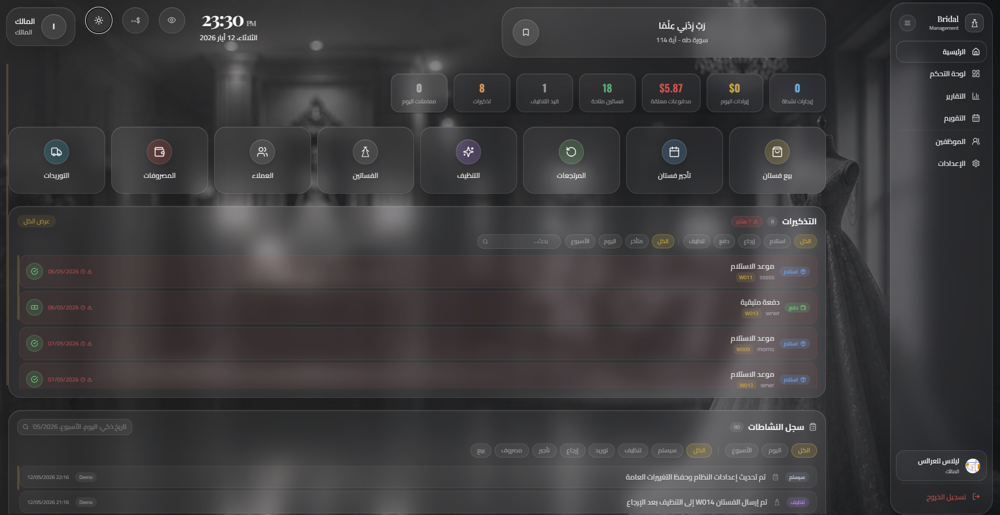
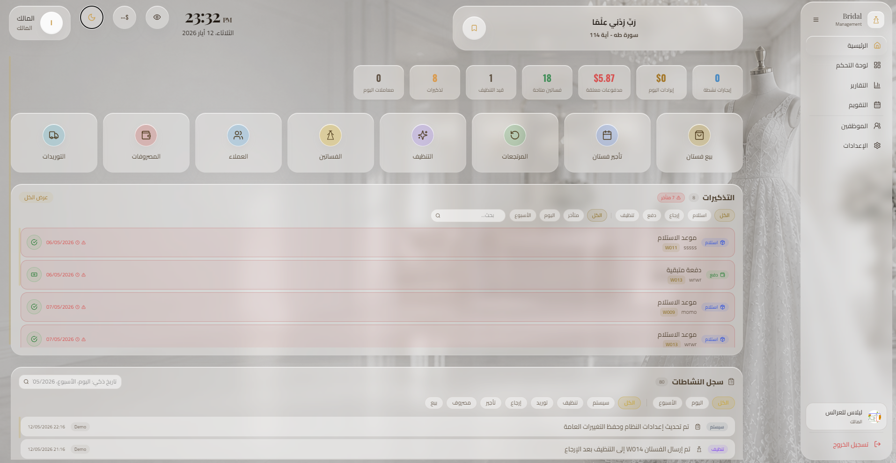
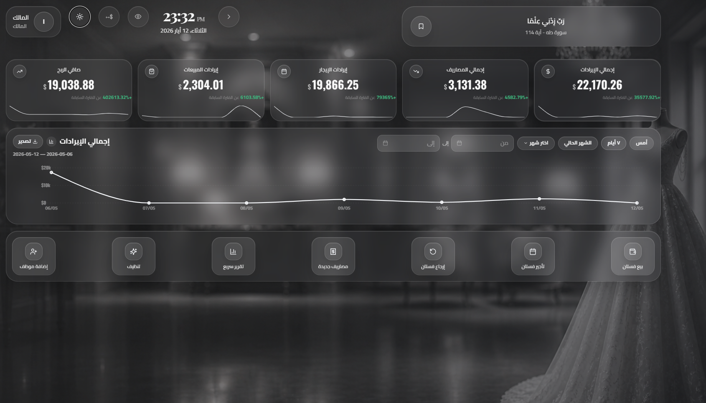
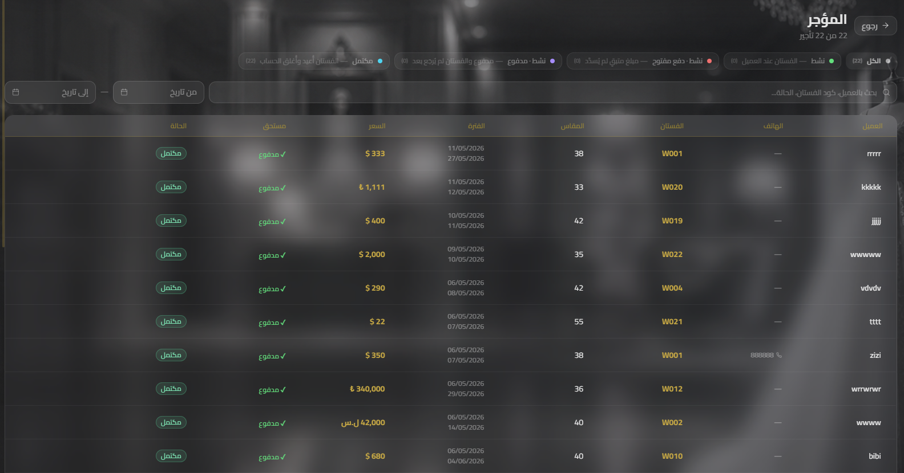
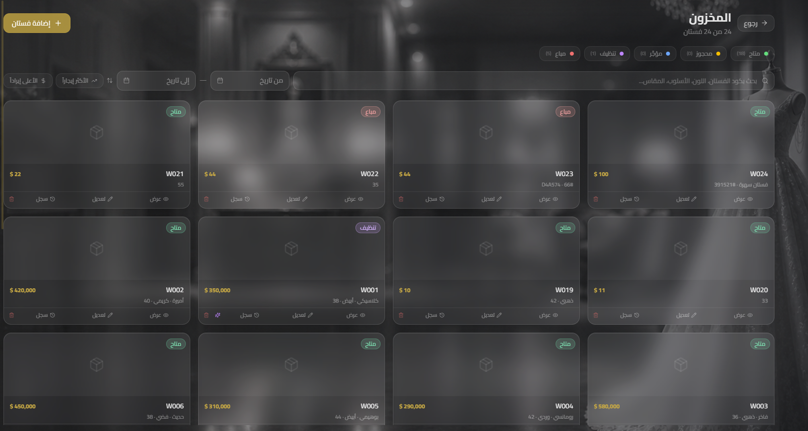
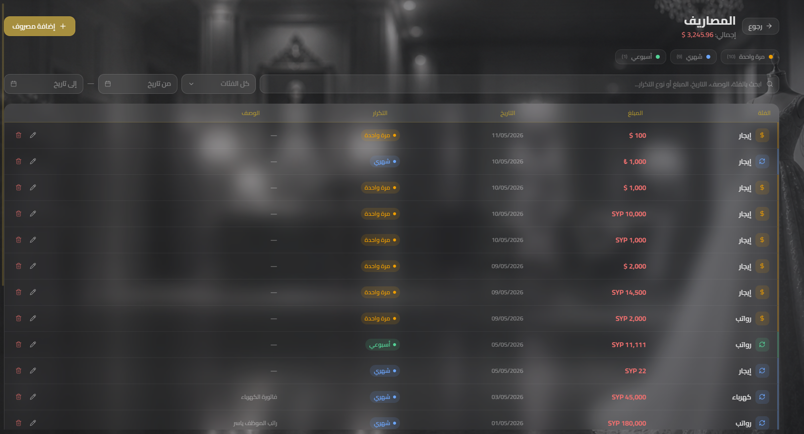

# BridalERP — نظام إدارة محل الفساتين

A fully offline, desktop-native ERP application built for bridal dress shops. Manages the complete business workflow — from inventory and rentals to sales, deliveries, expenses, and customer history — with a polished Arabic-first UI and full dark/light mode support.

---

## Screenshots

### Home — Quick Overview (Dark Mode)

The main landing page gives staff an immediate overview of the day. The top bar shows the current time, date, and logged-in user. A row of live stat chips displays: total transactions today, pending reminders, dresses in the cleaning queue, available dresses in stock, pending payment amounts, today's revenue, and active rentals. Below that, a grid of quick-action buttons provides one-click navigation to every core workflow — Deliveries, Expenses, Customers, Dresses, Cleaning, Returns, Rent a Dress, and Sell a Dress. The lower half shows the **Reminders panel** (overdue items highlighted in red with date and dress code) and the **Activity Log** showing a timestamped feed of recent system events.

---

### Home — Light Mode

The same home page rendered in light mode, showcasing the glassmorphism design system with frosted-glass cards against a blurred bridal dress background. All stat chips, quick-action buttons, reminder rows, and activity entries are fully readable with theme-aware dark-brown typography. Demonstrates that the entire interface is designed for both dark and light environments without any visual compromise.

---

### Owner Dashboard — Financial KPIs & Revenue Chart

The owner-only dashboard presents a full financial snapshot for any selected date range. Five KPI cards show: **Total Revenue**, **Rental Revenue**, **Sales Revenue**, **Total Expenses**, and **Net Profit** — each with a percentage change compared to the previous period and a sparkline trend. Below the cards, a full-width line chart visualises daily revenue over the selected period (default: last 7 days). A quick-action bar at the bottom provides shortcuts to: Sell a Dress, Rent a Dress, Return a Dress, New Expense, Quick Report, Cleaning, and Add Employee.

---

### Rentals — Full Rental List

The rentals module lists every rental contract in a sortable, filterable table. Filter tabs at the top segment rentals by status: **All**, **Active** (dress still with customer, payment pending), **Active — open payment** (dress out, no payment recorded), **Paid & Active** (payment received, dress not yet returned), and **Completed** (dress returned and account settled). Each row shows the customer name, phone number, dress code, size, rental period (start → end dates), total price, amount due, and a color-coded status badge. Green **Completed** and **Paid** badges make it instantly clear which contracts are fully resolved.

---

### Inventory — Dress Grid

The inventory screen displays all dresses as a responsive card grid. A status legend at the top shows live counts per category: **Available** (متاح, green), **Reserved** (محجوز, amber), **Rented** (مؤجر, blue), **Cleaning** (تنظيف, purple), and **Sold** (مباع, red). Each card shows the dress photo (or a placeholder icon), dress code (W001–W024), price, size, and style/color details. A status badge is pinned to the top corner of every card. Action buttons at the card footer allow quick access to View, Edit, History, and Delete. The search bar supports filtering by code, color, style, and size simultaneously.

---

### Expenses — Expense Tracker

The expenses page tracks all shop outgoings in a detailed table. Filter tabs group expenses by recurrence: **One-time** (مرة واحدة), **Monthly** (شهري), and **Weekly** (أسبوعي) — with counts per group. Each row shows the expense category (Rent, Salaries, Electricity, etc.), amount in the original currency (USD, SYP, or TRY), date, recurrence type with a color-coded badge, and an optional description. A running total is displayed in the page header. Date-range filters and a full-text search bar allow quick lookup across all records. Edit and delete buttons appear inline on each row.

---

## License

Private — all rights reserved.

BridalERP is a standalone desktop application with zero cloud dependency. All data is stored locally in an embedded SQLite database. The app is built with Tauri (Rust backend) + React (TypeScript frontend), giving it a native feel with a tiny footprint.

The interface is fully localized in Arabic (RTL layout) with optional German language support, and ships with a custom glassmorphism design system in both dark and light themes.

---

## Features

### Inventory Management
- Add, edit, and archive dresses with photos, codes, sizes, colors, and pricing
- Track dress status: available, rented, sold, or under cleaning
- Cleaning log with date tracking per dress
- Detailed dress view with full rental and sale history

### Rentals
- Create rental contracts with start/end dates, deposit, and balance tracking
- Track rental status: active, completed, overdue, or cancelled
- Automatic reminders for upcoming pickups and returns
- Linked directly to inventory — rental updates dress availability in real time

### Sales
- Record full dress sales with payment tracking
- Support for multi-currency transactions (USD, SYP, TRY)
- Sale history per customer and per dress

### Customers
- Customer profiles with contact info and full transaction history
- View all rentals, sales, and payment records linked to a customer
- Search and filter across all customers

### Deliveries
- Track incoming inventory deliveries from suppliers
- Log delivery date, supplier name, item count, and cost
- Linked to inventory additions

### Expenses
- Record and categorize shop expenses
- Filter by date range and category
- Totals and summaries per period

### Calendar
- Monthly calendar view with all upcoming events
- Event types: rental start, rental return, payment due, cleaning, delivery, reminders
- Double-click any day for a detailed event breakdown
- Color-coded event chips per category

### Reminders
- Create custom reminders tied to specific dates
- Alert types: pickup, return, payment, cleaning
- Overdue highlighting and status tracking

### Reports
- Revenue summaries by period (daily, monthly, yearly)
- Top-performing dresses and most active customers
- Expense breakdown and profit overview
- Printable report output

### Dashboard
- At-a-glance daily stats: revenue, active rentals, pending payments
- Live currency converter (USD ↔ SYP ↔ TRY)
- Quick-access recent activity feed

### Settings
- User management with role-based access (Owner, Employee, Cashier)
- Theme toggle (dark / light)
- Language toggle (Arabic / German)
- Default display currency selection
- Auto-logout timer
- Exchange rate configuration
- Shop info (name, phone, city, address) for invoices
- Database backup with one click
- License key activation

---

## Tech Stack

| Layer | Technology |
|---|---|
| Desktop runtime | [Tauri 2](https://tauri.app) (Rust) |
| Frontend framework | React 18 + TypeScript |
| Styling | Tailwind CSS 3 + custom design tokens |
| Animations | Framer Motion |
| Database | SQLite via `rusqlite` (embedded, no server) |
| State management | Zustand |
| Forms | React Hook Form + Zod |
| Charts | Recharts |
| Icons | Lucide React |
| i18n | i18next + react-i18next |
| Build tool | Vite 5 |

---

## Project Structure

```
BridalERP/
├── src/                        # React frontend
│   ├── components/             # Shared UI components (Button, Modal, FilterBar, etc.)
│   ├── modules/                # Feature modules
│   │   ├── auth/               # Login screen
│   │   ├── calendar/           # Calendar page
│   │   ├── customers/          # Customer list & history
│   │   ├── dashboard/          # Home dashboard
│   │   ├── deliveries/         # Delivery tracking
│   │   ├── employees/          # Employee management
│   │   ├── expenses/           # Expense tracking
│   │   ├── home/               # Landing/overview
│   │   ├── inventory/          # Dress inventory & cleaning
│   │   ├── reminders/          # Reminders list
│   │   ├── rentals/            # Rental management
│   │   ├── reports/            # Reports & analytics
│   │   ├── sales/              # Sales management
│   │   └── settings/           # App settings
│   ├── store/                  # Zustand stores (UI state, auth, etc.)
│   ├── hooks/                  # Custom React hooks
│   ├── lib/                    # API bridge to Tauri backend
│   ├── i18n/                   # Arabic and German translation files
│   ├── types/                  # Shared TypeScript types
│   └── utils/                  # Helpers (theme tokens, formatting, etc.)
│
├── src-tauri/                  # Rust backend
│   ├── src/
│   │   ├── commands/           # Tauri command handlers (one file per feature)
│   │   ├── db.rs               # SQLite connection, schema migrations
│   │   ├── models.rs           # Rust data models
│   │   ├── auth_guard.rs       # Role-based access control
│   │   ├── validation.rs       # Input validation
│   │   └── main.rs             # App entry point, command registration
│   └── Cargo.toml
│
├── index.html                  # App shell (RTL, Arabic fonts)
├── tailwind.config.js          # Design tokens, custom colors
├── vite.config.ts
└── package.json
```

---

## Getting Started

### Prerequisites

- [Node.js](https://nodejs.org) 18+
- [Rust](https://rustup.rs) (stable toolchain)
- [Tauri CLI prerequisites](https://tauri.app/v1/guides/getting-started/prerequisites) for your OS

### Install dependencies

```bash
npm install
```

### Run in development mode

```bash
npm run tauri dev
```

This starts the Vite dev server and the Tauri window simultaneously. Hot reload is active for the frontend.

### Build for production

```bash
npm run tauri build
```

Produces a native installer in `src-tauri/target/release/bundle/`.

---

## Database

The SQLite database is created automatically on first launch and stored in the system's app data directory. Schema migrations run on startup — no manual setup required.

A backup of the database can be exported at any time from **Settings → Backup**, which saves a `.db` file to the Downloads folder.

---

## Access Control

Three built-in roles:

| Role | Access |
|---|---|
| **Owner** (مالك) | Full access to all features and settings |
| **Employee** (موظف) | Access to operational modules; no settings or user management |
| **Cashier** (كاشير) | Limited to sales and payment-related views |

---

## Multi-Currency Support

The system's base currency is **USD**. Exchange rates (USD→SYP, USD→TRY, TRY→SYP) are configured manually in Settings and stored locally. A live currency calculator is available on the dashboard and in the settings panel.

---

## License

Private — all rights reserved.
